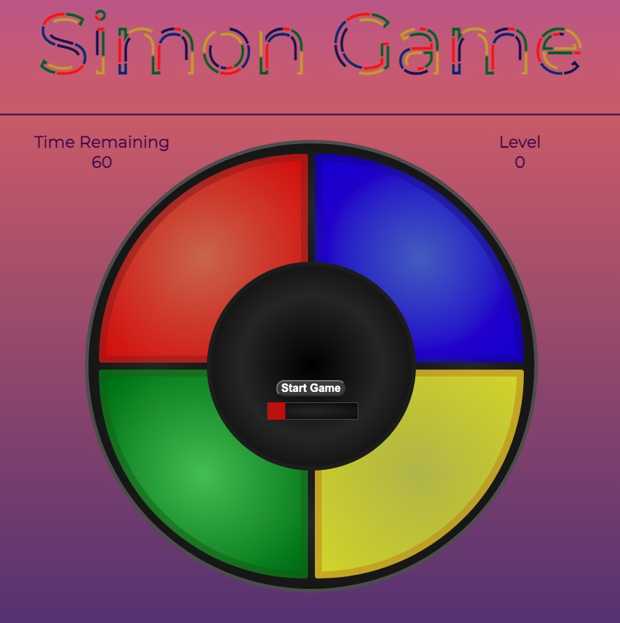

# Simon Game 

This is a digital remake with custom additions of the popular memory game in the late 1970s called Simon Game! 
In the game's circular frame, it contains a number of cells which light up in a randomized order. The objective is to click each cell in correct sequential order with each level increasing the sequence by one.

## Table of Contents
* [General Information](#general-information)
* [Programming Tools Used](#programming-tools-used)
* [Features](#features)
* [Usage](#usage)

## General Information
The intention of this project is to use HTML, CSS, and vanilla JS to create a static webpage game.

## Programming Tools used
* Javascript ES2015
* Git v2.33.1 Mac
* Visual Studio Code v1.62.3

## Features
### Implemented
* In addition to the original game mode, created 2 game modes with increasing difficulty and cells
* Generated DRY code for random cell light up dependent on current game state and length of cell array
* Implemented animation of elements bouncing inside viewport as an exclusive feature of the third game mode for increased difficulty.

### Development Ideas
* Increase difficulty of game with multiple games happening at the same time, use keyboard event listeners
* Create animations for cell click and in-game status messages

## Usage
[Click Here](https://lejt.github.io/SimonGame/) to play my game! 
