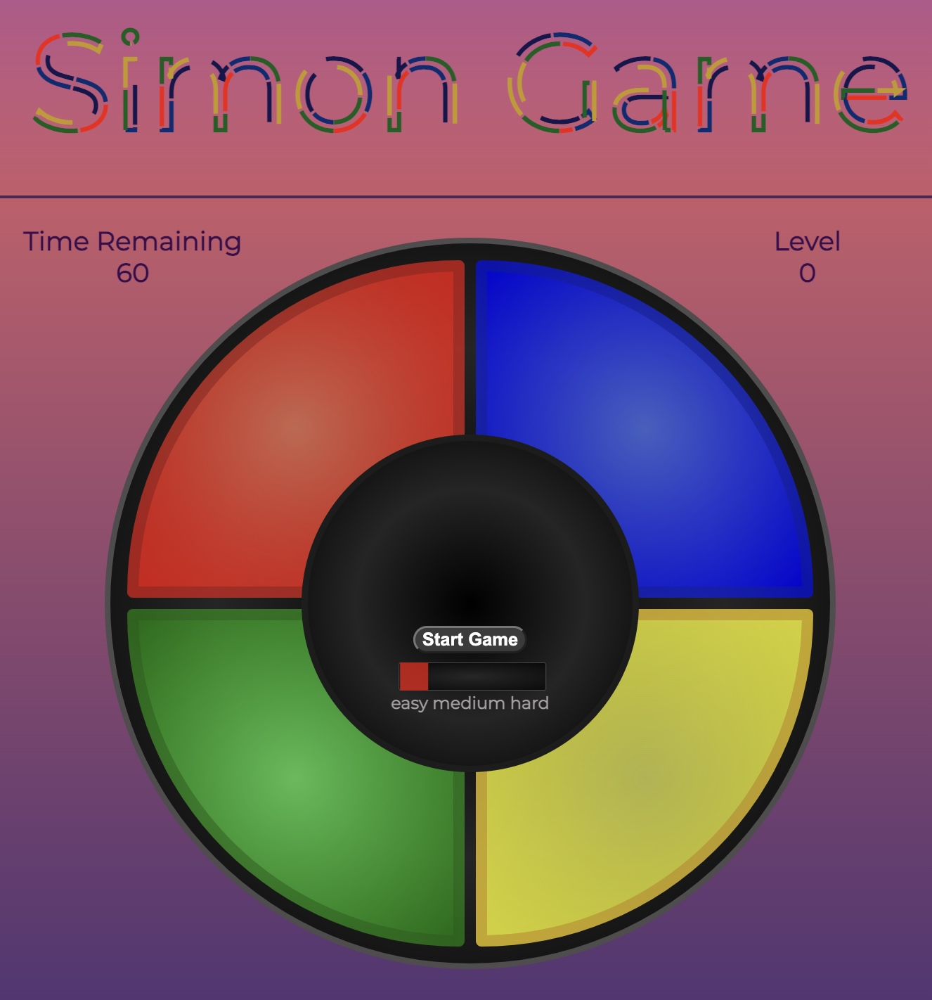

# Simon Game 

This is a digital remake with custom additions of the popular memory game from the late 1970s called Simon Game! 
The game contains a various number of cells which light up in a randomized order. The objective is to click each cell in correct sequential order with each level increasing the sequence by one. Get as far as you can in levels before the time runs out! There are 3 modes of increasing difficulty!

## Table of Contents
* [General Information](#general-information)
* [Technologies Used](#technologies-used)
* [Features](#features)
* [Usage](#usage)

## General Information
The intention of this project is to use HTML, CSS, and vanilla JS to create a static webpage game.

## Technologies used
* HTML, CSS, & Javascript
* Javascript ES2015
* Git v2.33.1 Mac
* Visual Studio Code v1.62.3

## Features
### Implemented
* In addition to the original game mode, 2 more game modes were created with increased speed and number of cells
* Generated DRY code for random cell light up dependent on current game state and length of cell array
* Implemented animation of elements bouncing inside viewport as an exclusive feature of the third game mode for an added layer of annoyance and difficulty.

## Usage
[Click Here](https://lejt.github.io/SimonGame/) to play my game! 

### Development Ideas
* Increase difficulty of game with multiple games happening at the same time, use keyboard event listeners
* Create animations for cell click and in-game status messages
